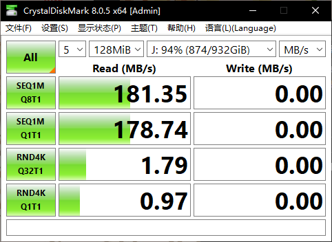
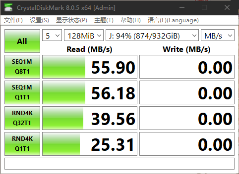
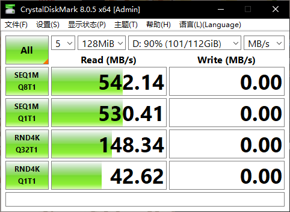
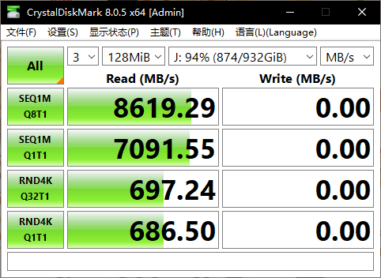

# FlyDisk

[简体中文](../README.md) | **English**

Block-level cache accelerator for hard drives on Windows · Make your HDD fly!

> This project is in **Beta**. It is not guaranteed to be 100% stable — **do not use it for important data**.

## Introduction

FlyDisk is an acceleration tool for **hard disk drives (HDD)**. It takes over the HDD you choose and lays a cache made of memory and SSD in front of it, keeping frequently read "hot data" **on the faster disk or in memory**, thereby easing the HDD's old problems: **slow seeks and slow random reads**.

It works at the block level, meaning it **takes over an entire physical drive**: after you click "Start Acceleration", the program puts the target drive **offline and exclusively opened**, then re-exposes it to Windows through a local iSCSI target. Windows mounts the drive's existing NTFS volume as usual, and **the original drive letters come back**. From then on, all reads and writes to that iSCSI drive go through the cache layer.

## ⚠ Please Read Before Use

- This software is in **Beta**. It is not guaranteed to be 100% stable — **do not use it for important data**. We accept no liability for any resulting loss.
- In theory there is a **very small possibility of a game ban**. If you use it for game acceleration, always test it first on a **new throwaway account** with **at least a week of intensive gaming**.
- After you stop acceleration, the target drive stays **offline and invisible** to the system (this is intentional: the drive belongs to this program exclusively, which is what makes cross-reboot caching trustworthy). To give the drive back to the system, see "Re-onlining the Drive".
- The program **must run as administrator** (the installer declares this, so double-clicking triggers UAC). Otherwise it cannot take a drive offline or open it exclusively.

## Quick Start

If this is your first time, just follow these steps.

1. Double-click `FlyDisk` and click "**Yes**" in the UAC prompt (if any). The main window appears.
2. Click the "**Start Acceleration**" button in the middle, which opens the "**Select a Drive to Accelerate**" dialog.
3. Pick the HDD you want to accelerate from the list and click "**OK**".
4. The program starts. It usually takes about 5 seconds, with progress printed in the log area.
5. Once the center button reads "Stop Acceleration", open "This PC" and confirm the drive looks normal.
6. Start using your drive and feel the **blazing speed**.
7. When you are done, you can click "**Stop Acceleration**" to idle the drive, or just shut down (not highly recommended, as stability is not fully tested). Next time, run "**Start Acceleration**" again.

> **Tip**: The benefit depends on whether your access pattern has "hot spots". It is most noticeable when you repeatedly open the same software or read the same batch of files; in scenarios with no repetition, such as full-disk sequential reads/writes, the gain is limited.
>
> Auto-start on boot and automatic acceleration are not supported yet.

## Benchmark Results

| HDD before acceleration | HDD after acceleration | For comparison, SSD |
| :----------------: | :----------------: | :----------------: |
|  |  |  |

As you can see, after acceleration, although pure sequential read/write performance drops somewhat, random read/write performance improves by roughly **25x**, even approaching SSD levels at low queue depths.

Given that the program currently focuses on random read/write optimization, this is understandable. There is still much room for development in sequential performance.

However

### For comparison, PrimoCache accelerating the same HDD

The performance gain is not on the same order of magnitude. If you can afford it, we still recommend buying PrimoCache.

However

## Real-World Results

| Method | Genshin Impact launch (Snezhnaya) | Genshin Impact teleport (Voyaniya Sha Complex) |
| --- | --- | --- |
| Before acceleration / cold start | 4 min | 12 s |
| L2 accelerated warm start | 1 min 58 s | 10 s |
| L1 accelerated warm start | 1 min 08 s | - |
| PrimoCache L1 accelerated warm start | 1 min 20 s | 6 s |

As you can see, although PrimoCache has a clear advantage in benchmarks, in real usage (at least in Genshin Impact) the gap between the two is not large.

## Two Cache Levels: L1 / L2

FlyDisk's cache has two levels, uniformly called the **L1 cache** and the **L2 cache**.

| Level | Medium | Characteristics | After power loss |
| --- | --- | --- | --- |
| **L1 cache** (memory cache) | System memory | Fastest, small capacity, evicted automatically based on overall memory usage | Not retained |
| **L2 cache** (disk cache) | Another drive (SSD recommended) | Slower than memory but usually larger, retained across reboots | Retained |

### How the Cache Works

We currently support read caching only. When the system needs to read data from the drive:

- Default system behavior: read directly from the source drive (there is a small amount of memory cache, but it is usually negligible).
- Our behavior: read preferentially from L1 / L2; only if the data is in neither do we fall back to the source drive, and at the same time place it directly into L1, and into L2 as needed, so that the next read of the same data is accelerated.

> **Note**: L2 survives reboots, but after an abnormal exit, the target drive being manually brought online, etc., a full verification is required to ensure the data is correct. If a problem is detected at startup, the program pops up a dialog for you to choose.

> **⚠ Warning**: When L2 is enabled, it is **your responsibility to avoid** operations that make **L2 and the actual data inconsistent**, such as manually offlining the drive, or using the drive from another computer or another OS under a dual-boot setup. Our program cannot reliably detect these automatically, so you should **manually trigger an L2 verification**. If you are unsure whether your operations could cause such a problem, you should also **manually trigger an L2 verification**.

## License

This project is released under the **GNU GPL v3 or later** (GPL-3.0-or-later); the full text is in [LICENSE](../LICENSE). Every source file also carries a copyright and license header at the top.

The list of third-party components and licenses is in [THIRD-PARTY-NOTICES.md](../THIRD-PARTY-NOTICES.md), and the full texts of the licenses distributed with the program are under `FlyDisk/Licenses/`.

Copyright (C) 2026 youke1686 (https://github.com/youke1686)
